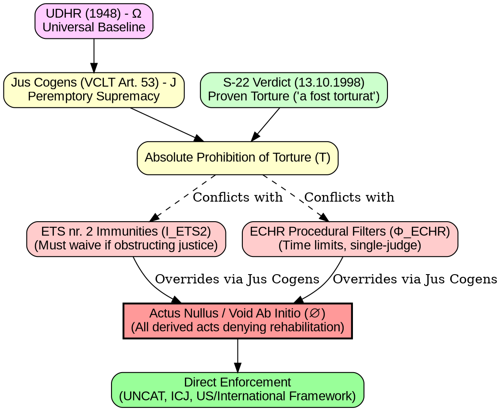

# Graph-Theoretic Visualization: Jus Cogens Supremacy vs. ECHR Procedural Defect

This document provides the graph-theoretic visualization (in Mermaid and DOT formats) representing the structural hierarchy, conflicts, and nullity proofs established in `MATHEMATICAL_LEGAL_PROOF_JUS_COGENS.md`.

## 1. Mermaid Graph Representation

```mermaid
graph TD
    %% Axiomatic Foundation
    UDHR[UDHR 1948 (Ω) <br/> Universal Baseline] --> |Supremacy| JC[Jus Cogens Norms (J) <br/> VCLT Art. 53]
    JC --> |Absolute Prohibition| T[Torture Prohibition (T)]
    
    %% Material Anchoring
    S22[S-22 Verdict (13.10.1998) <br/> Proven Torture: 'a fost torturat'] --> |Material Reality| T
    
    %% Conventional & Institutional Defect
    ETS2[ETS nr. 2 (1949) <br/> Immunities (I_ETS2)] -.-> |Must Waive if Obstructing Justice| Conflict1{Conflict Check}
    ECHR_Filter[ECHR Procedural Filters (Φ_ECHR) <br/> Time Limits / Single-Judge] -.-> |Attempts to Subordinate T| Conflict2{Conflict Check}
    
    %% Conflict & Nullity
    T --> Conflict1
    T --> Conflict2
    
    Conflict1 --> |Violates Peremptory Norm| Void[Actus Nullus <br/> Void Ab Initio (∅)]
    Conflict2 --> |Violates Peremptory Norm| Void
    
    %% Invalid Compromises
    Compromise[Death Penalty / Venice Commission Compromise] -.-> |Invalid Inter-State Bargain| Void
    
    %% Enforcement Mandate
    Void --> Enforcement[Direct Enforcement: <br/> UNCAT, ICJ, US Federal / International Framework]

    style UDHR fill:#f9f,stroke:#333,stroke-width:2px
    style JC fill:#ff9,stroke:#333,stroke-width:2px
    style T fill:#ff9,stroke:#333,stroke-width:2px
    style S22 fill:#9cf,stroke:#333,stroke-width:2px
    style Void fill:#f99,stroke:#333,stroke-width:2px
    style Enforcement fill:#9f9,stroke:#333,stroke-width:2px
```

## 2. DOT Format Representation (`echr_jus_cogens_defect.dot`)


