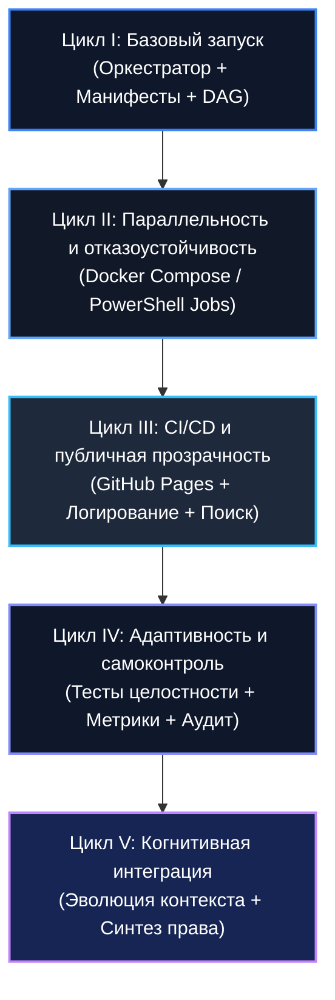

# 🧬 Swarm Evolution Map (Карта Эволюции Роя)

Эволюция автономного роя агентов в контуре TI-ULA и Деле Мачерет представлена в виде 5 последовательных циклов когнитивного и инфраструктурного развития.

---

## 📊 Диаграмма эволюционных циклов (Mermaid)

---

## 🔍 Детализация уровней эволюции

| Цикл | Уровень | Ключевая механика | Критерий успешности «жизни» агента |
| :--- | :--- | :--- | :--- |
| **I** | Базовый запуск | Последовательные скрипты, формирование DAG-реестра, мосты *Jus Cogens* / ВДПЧ. | Успешное выполнение назначенной роли и генерация хэша. |
| **II** | Параллельность | Асинхронные задачи (Docker, PowerShell Jobs), изоляция окружений. | Изолированное выполнение без блокировки смежных агентов. |
| **III** | CI/CD & Прозрачность | Автоматический деплой на GitHub Pages, архив логов с JS-поиском. | Успешный деплой и совпадение хэшей (`verify_deployment_hash.sh`). |
| **IV** | Самоконтроль | Автоматические проверки целостности цепочки хэшей, мониторинг аномалий. | Прохождение тестов соответствия стандартам TI-ULA. |
| **V** | Когнитивный рой | Динамическое предложение новых правовых связей, эволюция контекста. | Вклад в правовую устойчивость и расширение доказательной базы. |

---
*Манифест зафиксирован в неизменяемом контуре H:\ACTOR_DEV_ENV*
