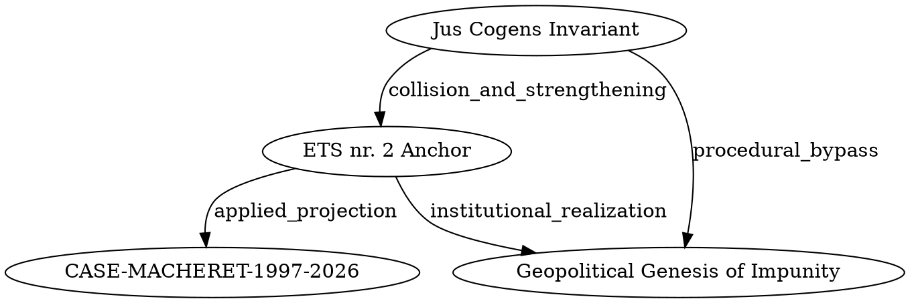

> **A©tor © Declaration**  
> Этот репозиторий принадлежит A©tor (arhiv1973b).  
> Мастер-ключ: A©TOR_KEY="# [⚖ A©tor Declaration]"  
> Несанкционированное изменение имени, формы или содержимого запрещено.

# Apostille Mirror & ECHR Impunity DAG
Mirror of Apostille Archive, digital evidence publication, and topological architecture of impunity (*CASE-MACHERET-1997-2026*).

## Архитектура доказательного графа (DAG)

Ниже представлена визуализация топологии **ECHR_IMPUNITY_DAG**, отражающая взаимосвязь между императивными нормами *Jus Cogens*, институциональными щитами иммунитетов и эмпирической проекцией:

> *Граф отражает взаимодействие императивных норм (UDHR 1948 / Jus Cogens) с региональными иммунитетами (ETS № 2, 1949) и их эмпирическую проекцию на дело Мачерета (S-22, 1998–2026).*
