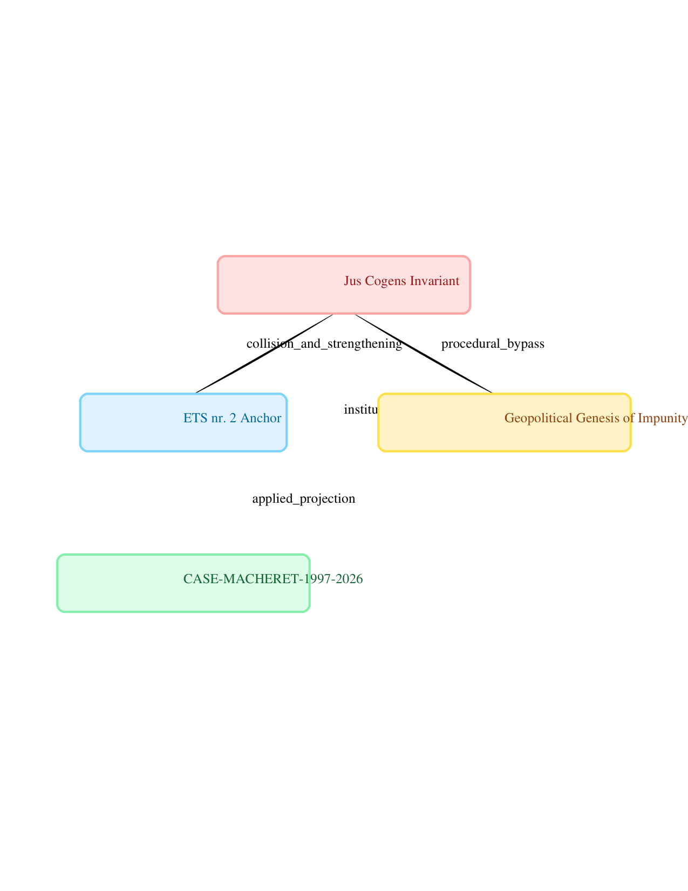
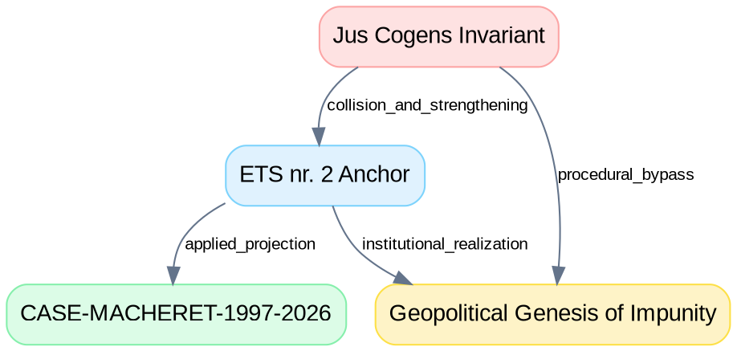

# ECHR_IMPUNITY_DAG — Topography of the Architecture of Impunity

## 📌 Назначение
Этот модуль является частью проекта **CASE‑MACHERET‑1997‑2026** и фиксирует архитектуру безнаказанности в европейском правовом контуре. Он объединяет:

- **Структурный граф (JSON)** — формализованная модель узлов и рёбер, связывающая императивные нормы *jus cogens*, институциональные фильтры иммунитетов (ETS № 2) и эмпирическую проекцию на дело Мачерета.
- **Доктринальный файл (Markdown)** — аналитическое ядро, раскрывающее правовую и топологическую механику взаимодействия этих элементов.

## 🗂 Состав пакета
- `ECHR_IMPUNITY_DAG.json`  
  Структурный граф доказательств (Directed Acyclic Graph). Узлы:  
  - **Jus_Cogens_Invariant** — императивные нормы международного права.  
  - **ETS_nr_2_Anchor** — институциональный щит иммунитетов Совета Европы.  
  - **Geopolitical_Genesis_of_Impunity** — встроенный дизайн безнаказанности.  
  - **Case_Macheret_Projection** — эмпирическая проекция на Молдову (1997–2026).  

- `Topography_of_Impunity.md`  
  Доктринальный текст, поясняющий:  
  - роль *jus cogens* как топологического инварианта;  
  - значение ETS № 2 как институционального фильтра;  
  - геополитический контекст Genesis;  
  - динамику рёбер (коллизия, обход, институциональная реализация);  
  - эмпирическую проекцию на дело S‑22 и феномен *continuing consequences*.  

## ⚖️ Юридическая база
- Всеобщая декларация прав человека (1948) — ст. 5, 8, 9.  
- Венская конвенция о праве международных договоров (1969) — ст. 53, 64.  
- Выводы Комиссии международного права ООН (ILC, 2022) — № 10, 21, 23.  
- ETS № 2 (1949) — Генеральное соглашение о привилегиях и иммунитетах Совета Европы.  

## 🚀 Использование
Пакет предназначен для:
- интеграции в репозиторий доказательств (`feature/evidence-deploy`);  
- визуализации архитектуры безнаказанности через DAG;  
- аналитической работы с доктринальным текстом;  
- демонстрации непрерывных последствий (*continuing consequences*) на примере CASE‑MACHERET‑1997‑2026.  

## 📊 Архитектура доказательного графа (DAG)

Ниже представлена визуализация топологии **ECHR_IMPUNITY_DAG**, отражающая взаимосвязь между императивными нормами *Jus Cogens*, институциональными щитами иммунитетов и эмпирической проекцией:



> *Граф сгенерирован автоматически на основе файла `ECHR_IMPUNITY_DAG.dot` с помощью утилиты Graphviz.*

Для наглядного представления структуры также можно использовать исходный код Graphviz:



Эта схема позволяет сразу увидеть, как императивные нормы (*jus cogens*) взаимодействуют с институциональными фильтрами ETS № 2 и проецируются на национальный контур (Молдова).

### Инструкция по генерации графического изображения
Чтобы быстро построить PNG или SVG изображение графа с помощью Graphviz (`dot`), выполните в терминале следующие команды:

```bash
# Генерация PNG
dot -Tpng ECHR_IMPUNITY_DAG.dot -o dag.png

# Генерация SVG (векторная графика)
dot -Tsvg ECHR_IMPUNITY_DAG.dot -o dag.svg
```
